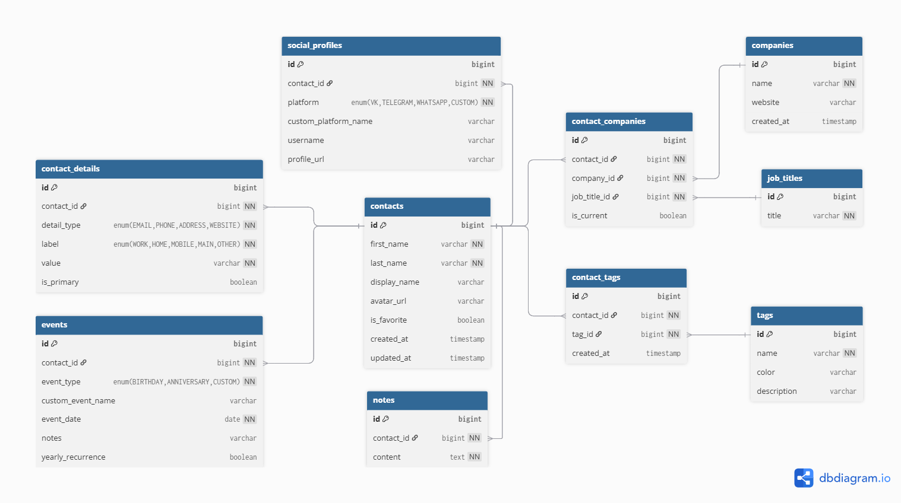

# Приложение для управления контактами
Приложение для управления контактами, реализованное с использованием Spring Boot. Оно предоставляет функциональность для работы с контактами через репозитории и сервисы, включая добавление, удаление, обновление и поиск контактов.

## ER-диаграмма


## Установка
1. Клонируйте репозиторий:
```
git clone https://github.com/cptntotoro/naumen_3.git
```
2. Соберите проект
```
mvn clean install
```

## Запуск приложения
1. Соберите исполняемый JAR-файл:
```
mvn clean package
```
2. Запустите JAR:
```
java -jar target/NauJava-0.0.1-SNAPSHOT.jar
```

## Мониторинг
http://localhost:8080/actuator/health — статус здоровья приложения
http://localhost:8080/actuator/metrics — метрики производительности